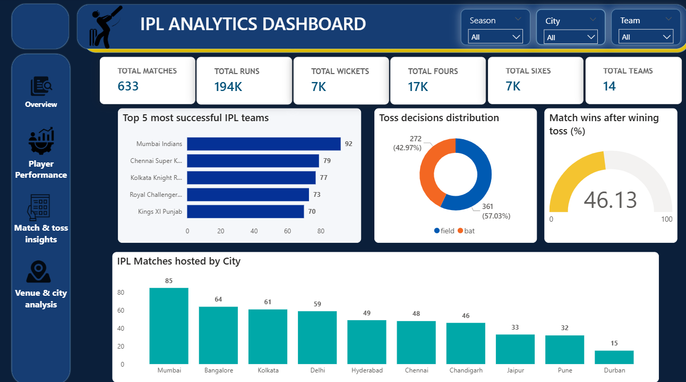
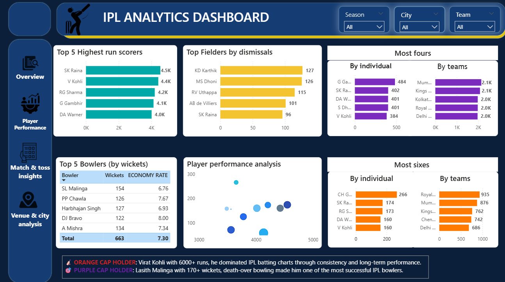

IPL Data Analytics Dashboard

This project analyzes IPL match data using Power BI.

The dashboard provides insights related to:
- Team performance
- Player statistics
- Toss analysis
- Venue analysis
- Match trends

Tools Used
- Power BI
- Power Query
- DAX
- Excel/CSV

Dashboard Features
- KPI Cards
- Interactive Filters
- Team Performance Analysis
- Player Performance Analysis
- Toss Insights
- Venue Analysis

Key Insights
- Mumbai Indians emerged as one of the most successful IPL teams.
- Virat Kohli dominated batting statistics.
- Lasith Malinga led wicket-taking charts.
- Teams preferred fielding first after winning the toss.
- Wankhede Stadium hosted a large number of IPL matches.

Dashboard Pages
- Overview

- Player Performance

- Match & Toss Insights

- Venue & City Analysis

Author
 
Anshika Bhati
